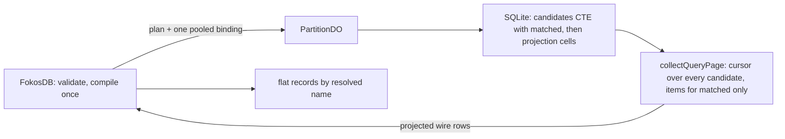

# RFC — Read projections and `queryItems` filters

**State:** Implemented
**Date:** 2026-09-14
**Author:** Lambros

## Table of contents

- [1. Overview and context](#1-overview-and-context)
- [2. Goals and requirements](#2-goals-and-requirements)
- [3. Milestones](#3-milestones)
- [4. Proposed solution](#4-proposed-solution)
- [5. Alternative options](#5-alternative-options)
- [6. Frequently asked questions](#6-frequently-asked-questions)
- [7. References](#7-references)
- [8. Appendix: pooled binding measurement](#8-appendix-pooled-binding-measurement)

## 1. Overview and context

### 1.1 The problem

Every read returns the complete item. `FokosDB.getItem`, `FokosDB.transactGetItems`, and `FokosDB.queryItems`
return `data` as stored, up to `MAX_ITEM_BYTES` (400 KiB) for each item. A caller that needs one field of a
400 KiB document receives the whole document. A `queryItems` page that needs the `status` of 1,000 items
transfers 1,000 complete items across the partition RPC and to the caller.

`queryItems` selects candidates by hash key and sort-key interval only. A caller that needs the orders of one
account with `status = "pending"` must page through every order of the account and filter in the client. The
partition reads and transfers every rejected item.

The typed expression engine of `docs/agent-plans/2026-08-29-typed-expression-engine-spec.md` ships write
conditions and update expressions. Its milestones M7 (projections) and M9 (query filters) are not built. The
`queryItems` selection RFC, `docs/agent-plans/2026-09-11-query-items-selection.md`, built the page accounting
that a filter needs and recorded the constraints a filter and a projection must meet in its sections 4.2.13 to
4.2.17. This RFC specifies both features and closes the items those sections left open: the executable plan
types, the statement shape, the binding layout, and the projected result types.

### 1.2 What the reader must know about the current system

- An expression is a typed AST. `ConditionExpression` is a predicate. `ExpressionValue` is a literal, a byte
  literal, a reference to `hashKey`, `sortKey`, `v`, `ttlAt`, or `data` with an optional JSON path, or a call
  to a Fokos operation or an allowlisted SQLite function. `ProjectionExpression` is `{ expr, as? }`.
- `FokosDB` validates and compiles an expression before it routes the request. A partition receives a compiled
  plan and checks its version, its binding count, and its SQL size. The partition materializes the plan's
  binding descriptors into SQL parameters immediately before it runs the statement.
- Every compiled plan today binds one SQL parameter for each distinct literal and each distinct JSON path.
  Workers SQLite allows 100 bound parameters in one statement. The compiler rejects a plan that exceeds the
  limit with the `sql_limit` expression error.
- The engine keeps `missing` and `null` apart, and it renders a native type name for every value with
  `renderType` in `src/shared/expression/compiler.ts`.
- `queryItems` returns one bounded page. Four budgets bound it: evaluated items, evaluated bytes, response bytes,
  and partition visits. `collectQueryPage` in `src/shared/query/query-collector.ts` builds the page from a
  synchronous SQL row stream. A candidate that a budget rejects stops the page with an inclusive cursor at that
  candidate. The leaf statement binds `LIMIT remainingEvaluatedItems + 1`.
- `queryItems` has `select: "projection" | "count"`. Count mode returns `items: []` and reads only `sk` and
  `est_row_bytes` from the covering index `idx_items_scan`.
- `transactGetItems` reads twice and compares `found`, `version`, and `deleteRevision` between the two phases.
  The two-phase driver pairs the phases by item key. A single-partition fast path, `txReadSnapshot`, reads once.
- The `ExpressionContext` type in `src/shared/expression/operation-registry.ts` already has the values
  `"filter"` and `"projection"`, and `canonicalProjectionIdentity` in `src/shared/expression/identity.ts`
  already exists. Neither is used by a public operation.

### 1.3 Glossary

| Term | Meaning in this document |
| --- | --- |
| Projection | An ordered list of `ProjectionExpression` entries. It selects the values a read returns. |
| Projected item | The flat record a projected read returns. One key for each projection entry. |
| Projection cell | One value of a projected item, as SQLite computes it and as the wire carries it. |
| Filter | A `ConditionExpression` that `queryItems` evaluates on every candidate. |
| Descriptor | One `ExpressionBindingDescriptor`: a literal, a path, or a key literal that the compiler bound. |
| Direct layout | The current binding layout. Each descriptor is one SQL parameter `?N`. |
| Pool layout | The new binding layout. Every descriptor is one element of one JSON array, bound once. |
| Candidate, evaluated item, matched item, materialized item | As defined in section 1.1 of `docs/agent-plans/2026-09-11-query-items-selection.md`. |

## 2. Goals and requirements

### 2.1 In scope

1. `queryItems` must accept `filter?: ConditionExpression`.
2. `queryItems` must accept `projection?: readonly ProjectionExpression[]`.
3. `getItem` must accept `projection?: readonly ProjectionExpression[]`.
4. Each item of `transactGetItems` must accept `projection?: readonly ProjectionExpression[]`.
5. A projected read must return a flat record. It must not return a complete item.
6. SQLite must evaluate the filter and the projection. JavaScript must not evaluate either.
7. The filter must not change candidate selection, routing, or the sort-key interval.
8. The compiled query plan and the compiled projection plan must be JSON-serializable and must round-trip
   through `JSON.stringify` and `JSON.parse` unchanged.
9. The number of SQL parameters of a query statement or a projected read statement must not depend on the
   number of literals and paths in the expression.
10. The page accounting of `docs/agent-plans/2026-09-11-query-items-selection.md` must hold with a filter:
    a rejected candidate advances the cursor and consumes both evaluated budgets, and consumes zero response
    bytes.
11. The cursor fingerprint must cover the filter identity and the projection identity.
12. A cursor from a request without a filter and without a projection must stay valid across this change.
13. The `transactGetItems` conflict detection must keep `version` and `deleteRevision` for a projected item.
14. Split forwarding, promotion, range-tree routing, and the migration fallback must carry the plans unchanged.
15. The HTTP example must accept and demonstrate a filter and a projection on every read operation.
16. The client-bundle boundary must not change.

### 2.2 Out of scope

| Item | Reason |
| --- | --- |
| Composite `val` literals (arrays and objects) | Milestone M8 of the typed expression engine spec. Validation keeps rejecting them. |
| Nested projection output | Version one output is a flat record; see section 12 of the typed expression engine spec. |
| A two-pass statement | It does not remove the binding limit and it is slower. Section 5.1. |
| Moving `CompiledConditionPlan` and `CompiledUpdatePlan` to the pool layout | No capacity problem today; a persisted plan needs a version bump. Section 6.7 records the path. |
| Date and time functions in filters | The allowlist rule of appendix A.4 of the typed expression engine spec stands. |
| A projection on a write operation's returned image | `returnValuesOnConditionCheckFailure` returns the complete image. |
| Filters on `getItem` and `transactGetItems` | A point read has a condition for that: it is a `check` in a transaction. |
| A client pagination helper | A future `FokosStd` method owns pagination. |
| A minimal phase-2 projection for `transactGetItems` | A follow-up on top of M4; section 6.6 gives the mechanism. |

### 2.3 Requirements that constrain the solution

- The query statement must stay in the ordinary CTE form of section 4.2.14 of
  `docs/agent-plans/2026-09-11-query-items-selection.md`. A workerd plan test must prove one `items` search, no
  `MATERIALIZE candidates`, and no `USE TEMP B-TREE FOR ORDER BY`.
- The filter must not appear in `WHERE`. It is a result column, so that a rejected candidate reaches the
  collector and advances the cursor.
- Every caller value and every caller path must be bound data. No caller text enters the SQL text.
- The complete statement must stay below `EXPRESSION_LIMITS.compiledSqlBytes` (100 KiB) and below
  `EXPRESSION_LIMITS.completeStatementBindings` (100).
- One pooled binding must cost at most 7% of the scan time of a 3,000-row page of 4 KiB rows with 90 literals,
  and must show no measurable cost for a single-row statement. Section 8 holds the measurement.
- Range-tree RPC calls stay sequential. Cloudflare limits a request to six simultaneous outgoing connections.

## 3. Milestones

Each milestone keeps `pnpm check` and `pnpm test` green. M1 changes no public API.

### 3.1 M1 — Projection library and pool layout

Deliver the `"projection"` validation context with the name and alias rules, the projection fragments of the
compiler, the pool binding layout in `bindDescriptor` and `materializeExpressionBindings`, the
`CompiledProjectionPlan` and `CompiledQueryPlan` types, their partition-side validators, the projection cell
decoder, and the Workers SQLite fixtures for every reference kind, every data kind, and every descriptor kind
under the pool layout. Deliver the JSON round-trip test on every new plan fixture.

### 3.2 M2 — `queryItems` projections

Deliver the `projection` request field, the `CompiledQueryPlan` with `filterSql: null`, the CTE statement with
`1 AS matched`, the projected rows of the query collector and their response-byte estimate, the RPC and client
types with the `queryItems` overload, the cursor fingerprint change, the rejection of `select: "count"` with a
projection, the plan-shape test, and the HTTP example.

### 3.3 M3 — `queryItems` filters

Deliver the `filter` request field, `filterSql` in the CTE, the flat statement for count mode with a filter,
the `matched` handling of the collector, and the filter test matrix of section 4.2.16.

### 3.4 M4 — Point-read projections

Deliver `getItem` and per-item `transactGetItems` projections on both read paths, the unique-key rule of
`transactGetItems`, the store method, the RPC variants, the client result types, and the HTTP example.

### 3.5 M5 — Hardening and documentation

Run the binding tests at the statement limit, measure one 400 KiB JSON item through a projection, update the
`queryItems paging` section of `AGENTS.md`, and cross-link this RFC from the two older specifications.

## 4. Proposed solution

### 4.1 High-level overview

A caller adds a `projection` to any read and a `filter` to `queryItems`:

```ts
const page = await db.queryItems({
  queries: [{ hashKey: "account#123" }],
  filter: {
    op: "and",
    args: [
      { op: "in", args: [{ ref: "data", path: "$.status" }, { val: "pending" }, { val: "processing" }] },
      { op: "gte", args: [{ ref: "data", path: "$.total" }, { val: 100 }] },
    ],
  },
  projection: [
    { expr: { ref: "sortKey" }, as: "orderId" },
    { expr: { ref: "data", path: "$.total" } },
    { expr: { fn: "sqlite.upper", args: [{ ref: "data", path: "$.status" }] }, as: "status" },
  ],
});
// page.items[0] === { orderId: "order#7", "$.total": 250, status: "PENDING" }
```

`FokosDB` validates both expressions and compiles them into one plan. The plan carries SQL fragments and an
ordered list of binding descriptors. The partition binds every descriptor as **one JSON array** and runs one
statement. SQLite evaluates the filter as a `matched` column and the projection as one value column and one
type column for each entry. The query collector reads `matched` and the type columns, advances the cursor over
every evaluated candidate, and materializes only matched candidates. The client turns each projected row into a
flat record with the names the plan resolved.

The same projection plan serves `getItem` and `transactGetItems`. A projected point read returns the record in
place of the complete item, and a transaction read keeps `version` and `deleteRevision` beside it so the
two-phase comparison is unchanged.



The pool layout is the mechanism that lets one page carry a 100-choice `in` list and a 48-entry projection in one
statement. The 100-parameter limit of Workers SQLite applies to the statement, and a pooled statement uses one
parameter for the whole expression plus the four scan parameters. Section 8 measures the cost: no difference at
8 and 32 literals, and at most 7% at 90 literals over 3,000 rows.

### 4.2 Technical details

#### 4.2.1 Public request types

```ts
type QueryItemsOptions = {
  queries: Array<{ hashKey: string | Uint8Array; sortKeyCondition?: SortKeyCondition; scanIndexForward?: boolean }>;
  limit?: number;
  maxResponseBytes?: number;
  cursor?: string;
  select?: "projection" | "count";
  filter?: ConditionExpression;
  projection?: readonly ProjectionExpression[];
};

type GetItemOptions = {
  hashKey: string | Uint8Array;
  sortKey?: string | Uint8Array;
  projection?: readonly ProjectionExpression[];
};

type TransactGetItemsOptions = {
  items: Array<ItemKey & { projection?: readonly ProjectionExpression[] }>;
};
```

Rules:

- `select: "count"` with a `projection` is rejected with `FokosValidationError` and the code
  `query_projection_with_count`. Count mode returns no item, so a projection has no meaning there.
- `select: "count"` with a `filter` is valid. `count` is then the matched count of the page.
- Two items of one `transactGetItems` request must not name the same key. The client rejects a duplicate with
  the existing code `transact_duplicate_key`. Section 4.2.11 gives the reason.
- Every expression error raises through `withExpressionErrors` as `FokosExpressionError` with the code
  `expression_invalid`, as conditions do today.

#### 4.2.2 Public result types

```ts
type ProjectedValue = JsonValue | Uint8Array;
type ProjectedItem = Record<string, ProjectedValue>;

type CallerType<T, Widest> = [T] extends [never] ? Widest : T;

type ReadItemValue<T = never> =
  | { kind: "bytes"; data: Uint8Array }
  | { kind: "text"; data: string }
  | { kind: "json"; data: CallerType<T, JsonValue> }
  | { kind: "projected"; data: CallerType<T, ProjectedItem> };

type ReadItem<T = never> = ItemKey & ReadItemValue<T> & { ttlAt?: number; version: number };

type GetItemResult<T = never> =
  | { found: true; item: ReadItem<T>; meta: OperationMetrics & PartitionInfo }
  | { found: false; item: ItemKey; meta: OperationMetrics & PartitionInfo };

type MaybeReadItem<T = never> = ({ found: true } & ReadItem<T>) | ({ found: false } & ItemKey);
type TransactGetItemsResult<Ts extends readonly unknown[] = never[]> = { items: { [K in keyof Ts]: MaybeReadItem<Ts[K]> } };

type QueryItemsPage<Item> = { items: Item[]; count; scannedCount; cursor?; meta; partitionMetas };
type QueryItemsResult<T = never> = QueryItemsPage<ReadItem<T>>;
type QueryItemsProjectedResult<T = never> = QueryItemsPage<CallerType<T, ProjectedItem>>;
```

A projected point read carries its record as `data` in the ordinary item envelope, and `kind` is
`"projected"`. One envelope, `ReadItem`, serves every read of every operation, so a caller reaches the value
through `item.data` whether it projected or not, and narrows on `kind` — the same field it already tests to use
`data`. `"projected"` is a public read-result kind only: `DataKind` stays the storage enum whose index is the
on-disk `data_kind` code, and no row ever stores this kind. Section 5.9 records the rejected alternative.

`kind` discriminates the value, so narrowing it also gives the type of `data`. `T` is the caller's own type of
the json value and of the projected record, for example `getItem<{ name: string }>({ hashKey, projection })`.
The store holds opaque data, so the library never checks `T`: it is a statement by the caller, like the type
argument of `JSON.parse` wrappers. A read that names no `T` keeps the widest type the library can return, which
is what `CallerType` resolves through the `never` default.

A projected query page keeps bare records. A page names its projection once, so a single overload types every
element exactly, and an envelope would add keys and a version that the projection did not ask for. Only the
element of the page differs between the two forms, so `QueryItemsPage` declares the page around its element
once and both result types are aliases of it. Each still takes `T`, so the type parameter means the caller's own
data type on every read method, and no caller has to wrap `T` by hand to name a result.

`FokosDB.getItem` and `FokosDB.transactGetItems` have one signature each: the projected result is a member of
the `ReadItem` union and needs no overload. `FokosDB.queryItems` keeps one overload, whose options type requires
`projection`, for the bare-record page above. All three take the type parameter, and the `ItemGetter`,
`ItemQuerier`, and `ItemTransactor` interfaces carry the same signatures.

`transactGetItems` answers each position with the same envelope, because each item chooses its own projection.
`item.found` alone reaches the value and `item.kind === "projected"` narrows the payload type. Its result follows
the naming of every other read method, `TransactGetItemsResult`, and carries no `outcome`: the value exists only
when the read committed, because every other end raises.

Its type parameter is a tuple, one member per item by position, because the purpose of the method is to read
unrelated items and one type for the call would describe none of them. The tuple fixes the item count as well,
and an array type gives one type to every position of a request of any length. The options are wrapped in
`NoInfer`, so a call that names no tuple keeps the widest types: the request keys are not a source of element
types, and without the guard they would infer `unknown` for every position.

The `queryItems` invariants become:

```ts
count <= scannedCount;
if (select === "projection") items.length === count;
if (select === "count") items.length === 0;
```

The `count === scannedCount` invariant of the selection RFC holds only when the request has no filter.

#### 4.2.3 Projection rules

A projection is an array of 1 to `EXPRESSION_LIMITS.projectionEntries` (48) entries. Each entry is
`{ expr: ExpressionValue; as?: string }` with no other field.

Name resolution, in order:

1. When `as` is present, the resolved name is `as`. It must be 1 to `EXPRESSION_LIMITS.projectionAliasBytes`
   (256) UTF-8 bytes.
2. When `expr` is `{ ref: "data", path }`, the resolved name is the exact `path` text.
3. When `expr` is another reference, the resolved name is the reference name: `hashKey`, `sortKey`, `v`,
   `ttlAt`, or `data`.
4. When `expr` is a call (`fn`) or a literal (`val`, `b64`), `as` is required.

Resolved names must be unique within one projection. Validation runs `analyzeExpressionValue(expr,
"projection")` on each entry, so a call that is not valid in the projection context is rejected. The read-path
validator rejects `$[#]`. Reverse indexes such as `$.items[#-1]` are valid.

Value rules:

- A `missing` value is omitted from the record.
- A JSON `null` and a SQL `NULL` result of a SQLite function are `null`.
- A JSON Boolean is a Boolean. SQLite has no Boolean type; the type column carries the distinction.
- A binary key and byte data are `Uint8Array`. A text key and text data are `string`. This is the existing
  public read boundary.
- A JSON array or object is the parsed `JsonValue`.
- A JSON path on text or byte data is `missing`.
- A SQLite function must not take the complete `data` reference as a direct argument. A SQLite function
  reads the stored form of a value, and for a JSON item that is the JSONB blob, which is not a public form.
  Validation rejects it with `invalid_type`. `size` and `attribute_type` accept the complete `data`, and a
  filter or a condition keeps accepting it, because their result never leaves the statement.
- The pass-through functions `sqlite.coalesce`, `sqlite.ifnull`, `sqlite.nullif`, and `sqlite.iif` take the
  type of the argument they return, so a JSON Boolean, array, or object passes through with its JSON type.
  Every other SQLite function is typed by SQLite: `null`, `number`, `text`, or `bytes`.
- A `missing` reference is SQL `NULL` inside a function argument, an absent sort key included, so `coalesce`
  and `ifnull` fall through it and `iif` returns `null` for it.

#### 4.2.4 Projection cells and the wire row

The compiler renders two SQL columns for each entry `k`:

| Column | SQL | Meaning |
| --- | --- | --- |
| `p{k}` | the value in `"logical"` mode; a whole `data` reference renders `CASE WHEN <isJson> AND json_type(i.data) IN ('array', 'object') THEN json(i.data) WHEN <isJson> THEN json_extract(i.data, '$') ELSE i.data END` | The cell value |
| `t{k}` | `CASE WHEN (<present>) THEN <renderType> ELSE 'missing' END`, folded when `present` is the constant `1` | The native type name |

A whole `data` reference renders an array or an object through `json()`, because the stored JSONB blob is not
the public form, and a root scalar through `json_extract(i.data, '$')`, so that the cell holds the SQL scalar
and the type column stays true. A path reference renders through `json_extract`, which returns JSON text for
an array or an object and a SQL scalar for a scalar. A SQLite function other than a pass-through never returns
an array or an object type; section 4.2.3 gives the pass-through rule.

The partition converts the two columns into one wire cell:

| `t{k}` | SQL value of `p{k}` | Wire cell |
| --- | --- | --- |
| `missing` | any | `undefined` |
| `null` | `NULL` | `null` |
| `boolean` | integer 0 or 1 | `false` or `true` |
| `number` | integer or real | `number` |
| `text` | TEXT | `string` |
| `bytes` | BLOB | `Uint8Array` |
| `array`, `object` | JSON text | `{ json: string }` |

```ts
type ProjectedWireCell = undefined | null | boolean | number | string | Uint8Array | { json: string };
type ProjectedWireRow = ProjectedWireCell[]; // aligned with the plan's resolved names
```

The wire row is positional. The client owns the compiled plan, so it owns the names. JSON text stays text across
the RPC and the client parses it once, which is the rule `data` follows today. The client builds each record
with `Object.fromEntries`, which creates an own property for any name, `__proto__` included.

The response-byte estimate of a projected row is the sum over its cells: `length * 2` for a string and for the
`json` text, `byteLength` for a `Uint8Array`, 8 for every other cell, plus the 64-byte item envelope that
`estimateItemBytes` charges. It does not use `est_row_bytes`.

A test must prove that `undefined` cells survive the RPC hop and the range-router concatenation.

#### 4.2.5 The pool binding layout

A compiled plan declares `bindingLayout: "pool"`. The plan keeps its ordered `bindings` descriptor list, so the
descriptor tests, the JSON round-trip test, and `materializeExpressionBindings` stay the one materializer.

The compiler renders descriptor `i` as one SQL form, chosen by its kind:

| Descriptor kind | Pool element | SQL form |
| --- | --- | --- |
| `val` string, number, or null | the JSON value | `json_extract(?P, '$[i]')` |
| `val` Boolean | JSON `true` or `false` | `json_extract(?P, '$[i]')`, which yields 1 or 0 |
| `path` | the path as a JSON string | `json_extract(?P, '$[i]')` |
| `keyText` | hex of `KeyCodec.encode(value)` | `unhex(json_extract(?P, '$[i]'))` |
| `keyB64` | hex of `KeyCodec.encode(decoded bytes)` | `unhex(json_extract(?P, '$[i]'))` |
| `b64` | hex of the decoded bytes | `unhex(json_extract(?P, '$[i]'))` |

`P` is the parameter number of the pool and is `1` for every pool plan: the pool is bound always, also as the
text `[]` when the plan has no descriptor, and the statement that runs the plan numbers its own parameters
explicitly from `?2`. `i` is a compiler-generated integer. Both are library-owned text. The kind is known at
compile time, so the `unhex` wrapper is fixed in the SQL and never depends on the row.

`materializeExpressionBindings(descriptors, "pool")` returns one value: the JSON text of the element array.
`KeyCodec.encode` is pure, so the client and the partition build the same text. The compiler builds it once at
compile time and rejects a text above `EXPRESSION_LIMITS.canonicalPayloadBytes` (512 KiB) with `sql_limit`. The
Cloudflare limit for one SQL value is 2 MiB, and the hex form doubles a byte literal, so this check is the one
that holds the pool below the platform cap.

Why it costs nothing per row: SQLite treats a bound parameter as a constant, and it hoists a deterministic
function of constants into the statement's init block under an `Once` opcode. `json_extract`, `unhex`, and
`jsonb` are deterministic. Section 8 shows the `Once` blocks in the `EXPLAIN` output. One exception exists:
SQLite does not hoist the left-hand side of an `IN` operator, by design. In this compiler that is the target of
the `in` operator and the type guards of the form `json_type(...) IN ('integer', 'real')`. Those extractions run
once per row. The pool text is a bound parameter, so SQLite's JSON cache serves it without a re-parse, and
section 8 measures the total cost at 0.4 to 1.3 microseconds per row.

Compaction keeps working: `compactPlanParameters` renumbers `?N` today. Under the pool layout it renumbers the
`$[i]` indexes of the surviving descriptors instead, so the pool array is dense.

`CompiledConditionPlan` and `CompiledUpdatePlan` keep the direct layout at their current versions. Their
fixtures do not change. Section 6.7 gives the path for a later switch.

#### 4.2.6 Compiled plan types

```ts
type CompiledProjectionPlan = {
  version: 1;
  kind: "projection";
  bindingLayout: "pool";
  /** Resolved output names, in entry order. */
  names: readonly string[];
  /** One value SQL fragment per entry, over alias `i`. */
  valueSql: readonly string[];
  /** One type SQL fragment per entry, over alias `i`. */
  typeSql: readonly string[];
  bindings: readonly ExpressionBindingDescriptor[];
  bindingCount: number;
  /** 1 pool + PROJECTION_FIXED_BINDING_COUNT (2: hk, sk); the pool is bound also when the plan has no descriptor. */
  completeBindingCount: number;
  requiredColumns: readonly ExpressionRequiredColumn[];
  dataDependencies: { completeData: boolean; paths: readonly string[] };
  identity: string;
};

type CompiledQueryPlan = {
  version: 1;
  kind: "query";
  bindingLayout: "pool";
  /** The predicate over alias `i`, or null when the request has no filter. */
  filterSql: string | null;
  /** The projection fragments, or null when the request returns complete items. */
  projection: { names: readonly string[]; valueSql: readonly string[]; typeSql: readonly string[] } | null;
  bindings: readonly ExpressionBindingDescriptor[];
  bindingCount: number;
  /** 1 pool + QUERY_MAX_TRAILING_BINDING_COUNT (4: hk, near bound, far bound, LIMIT). */
  completeBindingCount: number;
  requiredColumns: readonly ExpressionRequiredColumn[];
  dataDependencies: { completeData: boolean; paths: readonly string[] };
  filterIdentity: string | null;
  projectionIdentity: string | null;
};
```

The query plan compiles the filter and the projection in one `CompileContext`, so `bindDescriptor`
deduplicates a path or a literal that both use. The pool is parameter `?1` of every pool plan. The store
numbers the scan parameters of a query statement from `?2` upward in the order the SQL text names them, and
the projection statement numbers its keys `?2` and `?3` after the pool.

Workers SQLite requires the bound value count to equal the statement's parameter count. Every pool plan binds
its `?1` always — the text `[]` when the plan has no descriptor — because the statement that runs the plan
numbers its own parameters from `?2`, so an unused `?1` still counts as a parameter. The projection plan's
`completeBindingCount` is 3 and the query plan's is 5.

The compiler composes the widest statement of each plan at compile time and checks it against
`EXPRESSION_LIMITS.compiledSqlBytes`. The partition composes the same statement and checks it again, as
`validateConditionPlan` does. A `CompiledQueryPlan` with `filterSql: null` and `projection: null` is not
produced; the client sends no plan in that case.

#### 4.2.7 Query statement shapes

The leaf selects one of four statements from `select`, `filterSql`, and `projection`:

| `select` | Filter | Projection | Statement |
| --- | --- | --- | --- |
| `count` | none | rejected | The existing covering `idx_items_scan` scan. |
| `count` | present | rejected | The flat matched scan below. |
| `projection` | none | none | The existing complete-item scan. |
| `projection` | present or absent | present or absent, at least one | The CTE statement below. |

The flat matched scan for count mode:

```sql
SELECT sk, est_row_bytes, CASE WHEN (<filterSql>) THEN 1 ELSE 0 END AS matched
FROM items AS i
WHERE i.hk = ?2 AND <sort-key interval> AND <cursor condition>
ORDER BY sk ASC | DESC
LIMIT ?N
```

The CTE statement for projection mode:

```sql
WITH candidates AS (
  SELECT hk, sk, est_row_bytes, v, ttl_epoch_utc_seconds, data_kind, data, last_read_ts, last_write_ts,
         CASE WHEN (<filterSql>) THEN 1 ELSE 0 END AS matched      -- `1 AS matched` when filterSql is null
  FROM items AS i
  WHERE i.hk = ?2 AND <sort-key interval> AND <cursor condition>
  ORDER BY sk ASC | DESC
  LIMIT ?N
)
SELECT sk, est_row_bytes, matched,
       CASE WHEN matched THEN <p0> END AS p0, CASE WHEN matched THEN <t0> END AS t0,
       ...
FROM candidates AS i
ORDER BY sk ASC | DESC
```

When `projection` is null, the outer select returns the complete-item columns, each gated by `matched`, and the
`data` column decoded as the existing complete-item scan decodes it.

Rules:

- `LIMIT` binds `remainingEvaluatedItems + 1`, for the reason section 4.2.8 of the selection RFC gives.
- The CTE alias is `i`, and the outer query aliases `candidates` as `i`, so one rendered fragment serves both
  positions.
- The inner query selects every column a fragment can read. The `i.hk IS NOT NULL` presence terms of the
  compiler stay true for every CTE row, which costs one comparison per term.
- The count statement does not pin `idx_items_scan`. A filter over `data` needs the base table, and SQLite
  chooses the order-preserving index on its own.
- A plan test in workerd asserts, for the CTE statement: one `SEARCH items`, no `MATERIALIZE candidates`, and
  no `USE TEMP B-TREE FOR ORDER BY`. It checks the properties, not the exact plan text.

#### 4.2.8 Query collector

`QueryScanRow` gains `matched: boolean` and `projected: ProjectedWireRow | null`. The collector order of section
4.2.7 of the selection RFC holds, with the `matched` flag in place of the constant:

1. Increment `rowsReturned` when the SQL cursor yields the row.
2. Stop before the candidate when the evaluated-item budget is empty or `est_row_bytes` exceeds the remaining
   evaluated-byte budget. Set an inclusive `nextCursor`.
3. When `matched` and the mode is `projection`, estimate the response bytes of the materialized item or row.
4. Stop before the candidate when the estimate exceeds the remaining response budget and
   `allowOversizedFirstItem` is `false`. Set an inclusive `nextCursor`.
5. Increment `scannedCount`, add `est_row_bytes` to `evaluatedBytes`, and set `lastEvaluatedCursor`.
6. When `matched`, increment `count`. When the mode is `projection`, add the item or row and its bytes, and set
   `allowOversizedFirstItem` to `false`.

A rejected candidate therefore consumes both evaluated budgets, advances the cursor, and consumes zero response
bytes. `items` is `Array<StoredItem | ProjectedWireRow>`; the leaf fills one shape per request, and the client
narrows by the plan it sent.

#### 4.2.9 RPC contracts

```ts
type QueryItemsRpcRequest = {
  ...existing fields;
  plan: CompiledQueryPlan | null;
};

type QueryItemsRpcResponse = {
  items: Array<StoredItem | ProjectedWireRow>;
  ...existing counters and cursors;
};

type GetItemRpcRequest = ItemRpcKeys & { projection?: CompiledProjectionPlan };

type GetItemRpcResponse =
  | { found: true; item: { data; kind; ttlAt?; version }; meta }
  | { found: true; item: { projected: ProjectedWireRow; kind: "projected"; ttlAt?; version }; meta }
  | { found: false; meta };

type ReadForTransactionRequest = {
  transactionId: TransactionId;
  items: Array<TransactionItemKey & { projection?: CompiledProjectionPlan }>;
};
type ReadSnapshotRequest = { items: Array<TransactionItemKey & { projection?: CompiledProjectionPlan }> };

type ReadForTransactionItemResultEncoded =
  | { found: true; hashKey; sortKey; data; kind; version; ttlAt?; deleteRevision; hasPendingWrite }
  | { found: true; hashKey; sortKey; projected: ProjectedWireRow; kind: "projected"; version; ttlAt?; deleteRevision; hasPendingWrite }
  | { found: false; hashKey; sortKey; deleteRevision; hasPendingWrite };
```

The wire keeps the positional row under `projected` and never a record: only the client holds the resolved
names. `kind`, `version`, and `ttlAt` sit beside it, so the client copies the envelope fields from one place and
decodes the row into `data` at the public boundary.

Routing carries the plans with no change of its own: `withSplitForwarding` and `walkRangeChildren` spread the
request, the migration fallback passes the request to `internalQueryItemsDirect`, `#txReadForTransaction` spreads
the request into each child call, and `#txReadSnapshot` forwards `route.items`, which carry their projection.

#### 4.2.10 Cursor fingerprint

`computeCursorFingerprint(queries, filterIdentity, projectionIdentity)` appends to the existing buffer, after
the query list:

- Nothing, when both identities are null. The fingerprint of such a request is byte-identical to the current
  one, so a cursor issued before this change stays valid.
- Otherwise one byte `0` for an absent identity, or one byte `1`, a `u32` length, and the UTF-8 identity bytes
  for a present one; first the filter, then the projection.

The query list is length-prefixed, so the appended bytes are unambiguous. The cursor format and `CURSOR_VERSION`
do not change. `limit`, `maxResponseBytes`, `select`, and `cursor` stay excluded.

#### 4.2.11 Point reads

**`getItem`.** The store gains `getItemProjected(hk, sk, plan)`:

```sql
SELECT i.v, i.ttl_epoch_utc_seconds, <p0> AS p0, <t0> AS t0, ...
FROM items AS i
WHERE i.hk = ?2 AND i.sk = ?3
LIMIT 1
```

No row means `found: false`. A projection needs no `LEFT JOIN`: a condition must evaluate on an absent item, a
projection has nothing to return for one. `readItemLocally` selects the store method from the presence of the
plan. Split forwarding and the migration fallback are unchanged.

The statement selects `i.v` and `i.ttl_epoch_utc_seconds` beside the cells, so the envelope of section 4.2.2
costs no extra read and a projected read reports the same `version` a complete read reports.

**`transactGetItems`.** `readForTransactionLocal` selects `getItem` or `getItemProjected` for each item from
its own plan. The projected result keeps `version`, `deleteRevision`, and `hasPendingWrite`, so
`sameCommittedState` in `src/client/db.ts` compares the same three facts as today. Phase 2 sends the same
request as phase 1, projection included, and the result is the phase-1 record.

The two-phase driver pairs phase 1 with phase 2 by item key. Two request items with the same key would map to
one entry, and with two different projections one of them would receive the wrong record. The client therefore
rejects a request in which two items name the same key with `transact_duplicate_key`. This is a change: the
current API answers duplicates positionally. The fast path `txReadSnapshot` needs no pairing and inherits the
rule for one behaviour on both paths.

#### 4.2.12 Partition-side validation and errors

`validateQueryPlan` and `validateProjectionPlan` check, in this order: `version` and `kind`, `bindingLayout`,
the composed statement against `compiledSqlBytes`, `bindings.length === bindingCount`, and
`completeBindingCount` against `completeStatementBindings`. The projection validator also checks that `names`,
`valueSql`, and `typeSql` have one length, and that the length is 1 to `projectionEntries`.

| Failure | Behaviour |
| --- | --- |
| Invalid filter or projection AST, path, type, arity, alias, or limit | `FokosExpressionError` `expression_invalid`, from the client. |
| `select: "count"` with `projection` | `FokosValidationError` `query_projection_with_count`. New code; `pnpm error-segment` mints its segment. |
| Duplicate key in `transactGetItems` | `FokosValidationError` `transact_duplicate_key`, existing code. |
| Statement above the SQL or binding limit | `FokosExpressionError` with `expressionCode: "sql_limit"`, from the client. |
| Plan rejected on the partition | The same expression error, raised by the partition. |
| Workers SQLite fails on the statement | `FokosExpressionError` with `expressionCode: "runtime_capability"`. |
| Cursor from a request with another filter or projection | `cursor_fingerprint_mismatch`, existing code. |

A SQLite failure inside a filter aborts the whole page statement, and the same row aborts every retry of that
page. The literal-only rule for `glob` and `like` patterns of the typed expression engine spec is the guard
against the one such failure the engine knows.

#### 4.2.13 Limits

| Name | Value | Meaning |
| --- | --- | --- |
| `EXPRESSION_LIMITS.projectionEntries` | 48 | Entries in one projection. |
| `EXPRESSION_LIMITS.projectionAliasBytes` | 256 | UTF-8 bytes of one `as` alias. |
| `PROJECTION_FIXED_BINDING_COUNT` | 2 | `hk`, `sk` after the pool in a projected point read. |
| `QUERY_MAX_TRAILING_BINDING_COUNT` | 4 | `hk`, near bound, far bound, `LIMIT` after the pool in a query. |
| `EXPRESSION_LIMITS.canonicalPayloadBytes` | 512 KiB | Also the pool text limit. Existing value. |
| `EXPRESSION_LIMITS.compiledSqlBytes` | 100 KiB | The composed statement. Existing value. |
| `EXPRESSION_LIMITS.completeStatementBindings` | 100 | Existing value; a pooled statement uses at most 5. |

Workers SQLite limits a result set to 100 columns. The CTE statement has 3 fixed columns and 2 per entry, and the point-read statement 2 fixed and 2 per entry, so 48 entries is the largest count both statements accept (3 + 2 × 48 = 99).

#### 4.2.14 Performance

Section 8 gives the method and every number. In summary, on 4 KiB JSON rows in workerd:

- The pool layout and the direct layout are equal within the timer's resolution at 8 and 32 literals, for 300
  and for 3,000 rows.
- At 90 literals the pool costs 0.4 ms per 300 rows and 1.25 ms per 3,000 rows: 0.4 to 1.3 µs per row, at most
  7% of the scan.
- The single-row condition statement shows no difference at 8, 32, or 90 literals.
- `rowsRead` is identical in every pair, so the layout changes no access path.

The projected point read reads the same row as the complete read and returns fewer bytes. The projected query
reads the same rows as the complete scan and returns only the matched cells. A `count` query with a `data`
filter reads `data` inside SQLite and returns three columns per candidate.

#### 4.2.15 Deployment, rollback, and compatibility

The change adds no table, column, or index. No Durable Object migration is needed.

Additive changes: `filter` and `projection` on the requests, the `queryItems` overload, the optional type
parameter of the three read methods, and the `projected` member of the read envelope.

Changes that break an existing caller:

- `transactGetItems` rejects duplicate keys.
- Every read result discriminates `data` on `kind`, and `kind` gains `"projected"`. A caller that reads `data`
  after testing `kind` is unaffected. A caller that passes `data` on without testing `kind` gets the wider
  union and has to narrow.

The internal RPC request and response shapes change. As with the selection RFC, a Worker and a Durable Object on
different versions can fail a read during rollout; do not use a gradual deployment. A rollback restores the old
shapes and has no storage state to migrate.

The client entry keeps every server class as a type-only import. The `check-client-bundle` guard must pass.

#### 4.2.16 Testing

Expression library (M1):

- Every projection name rule: default names, aliases, a required alias, duplicates, empty and over-long aliases,
  the entry limit at 48 and 49.
- Every reference kind against every data kind through a projection cell: text, bytes, JSON object, JSON array,
  missing path, JSON null, Boolean, integer, real, reverse index, absent sort key, absent TTL, text and binary
  keys.
- Every descriptor kind under the pool layout, including `keyText` and `keyB64` against a binary key, and `b64`
  against byte data; the same fixtures give the same rows as the direct layout.
- Compaction of pool indexes after constant folding.
- Pool text at the 512 KiB limit and one byte above it.
- JSON round-trip equality of every `CompiledQueryPlan` and `CompiledProjectionPlan` fixture.

`queryItems` (M2, M3):

- Projection pages in both directions; `undefined` cells across the RPC hop and across a range router.
- A response stop during projection; the first oversized projected row of a page.
- Every condition operator as a filter, on mixed data kinds.
- A filter that rejects every candidate: `count: 0`, `scannedCount > 0`, a cursor, and no gap or duplicate in
  the pages that follow.
- Count mode with a filter: `items: []`, `responseBytes: 0`, `count < scannedCount`.
- Cursor identity: a cursor from a request with another filter or projection is rejected; a cursor from a
  request without both is accepted across the change.
- `count` + `projection` rejected.
- The CTE plan-shape test.
- A statement with a 100-choice `in` list and a 48-entry projection compiles and runs.
- Filters and projections through a hash split, a promoted key, a range tree, and a migrating child.

Point reads (M4):

- `getItem` projected and not found; through split forwarding and the migration fallback.
- `transactGetItems` projected on the fast path and on the two-phase path; a conflict between the phases still
  raises `read_conflict` for a projected item; a pending write still aborts; duplicate keys rejected.
- Mixed projected and complete items in one request, in request order.

HTTP example: a filter and a projection on `queryItems`, a projection on `getItem` and on `transactGetItems`,
and a `Uint8Array` cell serialized as `{ b64: string }`.

Verification commands from the repository root: `pnpm check`, `pnpm test`, `pnpm lint:pkg`. `pnpm test` runs in
a subagent.

## 5. Alternative options

### 5.1 A two-pass statement

A filter pass and a projection pass, with a second statement that joins matched keys through a `VALUES` list.
It splits the filter bindings from the projection bindings and nothing more: a filter with a 100-choice `in`
list still fails on its own. The selection RFC measured it at 2.7 times slower on 32 KiB rows at 50% match and
about six times the `rowsRead`. Rejected.

### 5.2 Inline literals in the SQL text

Quoting caller values into the SQL text removes the binding problem. It breaks the rule that no caller text
enters the SQL, moves the safety of every read onto a quoting function, and grows the SQL text toward its own
100 KiB limit. Rejected.

### 5.3 Pool only the `in` choice lists

`target IN (SELECT value FROM json_each(?k))` with one binding per `in` operator. It removes the largest single
consumer and keeps the direct layout elsewhere. It leaves a 48-entry projection plus a 30-literal filter at the
limit. The measurement in section 8 showed no cost that justified the smaller change, so the full pool is the
choice.

### 5.4 Keep the direct layout and reject with `sql_limit`

The simplest option. A projection of 48 paths and a filter with 30 literals, or one `in` with 96 choices, fails
with a limit error that the caller cannot work around inside one request. Rejected.

### 5.5 One `transactGetItems` projection for the whole request

Clean overload typing and no pairing rule. Less flexible than DynamoDB's per-`Get` projection. The per-item form
was chosen, with the unique-key rule of section 4.2.11 in place of a request index.

### 5.6 A union `items` type on `queryItems`

`items: Array<QueryItem | ProjectedItem>` forces every caller to narrow. Overloads give exact types to both
kinds of caller. Rejected for `queryItems` and `getItem`; `transactGetItems` needs a union because each position
chooses.

### 5.7 Ignore the projection in count mode

It hides a contradiction in the request. DynamoDB rejects `Select: COUNT` with a `ProjectionExpression`.
Rejected.

### 5.8 Assemble the projected record in SQL with `json_object`

One column per row instead of two per entry. `json_object` cannot hold a BLOB, so a binary key or byte data
fails, and the client could not tell a JSON string from JSON text without a type tag. Rejected.

### 5.9 A top-level `projected` field beside the item envelope

The first built form of section 4.2.2. It put the record in its own field, so `found: true` stopped
discriminating the payload: every caller, projecting or not, had to add a `"data" in item` test before reading a
value. Two payload field names also block the single item decoder that the roadmap wants across the three reads.
The record moved into `data` under `kind: "projected"`, which keeps one envelope and narrows on the field a
caller already tests. Rejected.

### 5.10 One options type and one result type per operation for a projected read

The second built form. Each point read carried a `…ProjectedOptions` and a `…ProjectedResult` type and one
overload that paired them. A projected result has the structure of a complete one, so the pair restated the
envelope for the sole purpose of choosing between two `data` types, and it multiplied by operation: two more
public names and one more overload each, for `getItem`, `queryItems`, and `transactGetItems`. The overload also
gave nothing beyond `kind`, which already discriminates the value. `"projected"` became a member of the one
`ReadItem` union instead, and the type parameter of section 4.2.2 gives the caller the precise type that the
separate result type could only give as `ProjectedItem`. `queryItems` keeps its overload alone, for the page of
bare records. Rejected.

## 6. Frequently asked questions

### 6.1 Does a filter reduce the work a page does?

No. A filter reduces the bytes a page returns. The page still evaluates every candidate in its interval, up to
the evaluated-item and evaluated-byte budgets, and a rejected candidate is charged like a matched one. This is
DynamoDB's `FilterExpression` model as well.

### 6.2 Why is the filter a result column and not a `WHERE` term?

A rejected candidate must reach the collector to advance the cursor and to be counted in `scannedCount`. In
`WHERE`, SQLite would discard it and the page could not resume after it. Section 5.6 of the selection RFC.

### 6.3 Why two columns per projection entry?

SQLite has no Boolean and returns a JSON array and a JSON string both as TEXT. The type column tells the decoder
which public value to produce. It costs one short string per cell on the SQL side and nothing on the wire.

### 6.4 Why is the wire row positional?

The client compiled the plan and holds the resolved names. Sending the names with every row would repeat them
for each item of a page.

### 6.5 Why does a pool lookup on the left side of `IN` run per row?

SQLite disables constant factoring for the left-hand side of `IN` because it can apply `OP_Affinity` to the
register afterward. The compiler's `in` operator and its `IN ('integer', 'real')` type guards fall under this
rule when their operand contains a pool path. The cost is measured in section 8. A later change can render the
compiler-owned type guards as `x = 'a' OR x = 'b'`, whose operands are factored; it changes rendered SQL and
not the plan shape.

### 6.6 Does the projection run in phase 2 of a read transaction?

Yes. Phase 2 sends the same request as phase 1. A phase-2 request without the projection would read the
complete item and return more bytes, not fewer. The result is the phase-1 record.

A follow-up on top of M4 can make phase 2 near zero for every two-phase read, projected or not. The driver
reads only `found`, `version`, `deleteRevision`, and `hasPendingWrite` from a phase-2 result, and the caller
receives the phase-1 record. The projected result variant of section 4.2.9 keeps those four facts. So the
driver can replace the projection of every phase-2 item with `[{ expr: { ref: "v" } }]`, and the projected
point-read statement of section 4.2.11 then reads no `data` column. `data` is the last column of `items`, so
that statement does not read the overflow pages of a large document. The change is one line in
`#readTransaction` and needs no new RPC, store method, or participant path. The single-partition fast path
reads once and is not affected.

### 6.7 Can `CompiledConditionPlan` and `CompiledUpdatePlan` use the pool later?

Yes. The layout is a property of the plan, not of the expression kind. A condition statement has 2 fixed
bindings and an update statement has 2 fixed plus 6 trailing, so the pool lifts both to the SQL text limit. The
plans persist in `tc_items.conditions_json` and `pending_transactions`, so the switch is a plan-version bump
with the old decoder kept while an in-flight transaction can hold the old version. Section 8 shows no measurable
difference for a single-row statement, so the switch costs nothing when it is wanted.

### 6.8 Why is a duplicate key in `transactGetItems` now an error?

The two-phase driver pairs the two phases by key. With per-item projections, two items with one key and two
projections would collide in that map. The rule keeps one pairing primitive and one behaviour on both read
paths.

### 6.9 Does an old cursor still work?

A cursor from a request without a filter and without a projection has the same fingerprint as before, because
the fingerprint appends nothing in that case. A cursor from a request with either is new by definition.

### 6.10 What happens on a `hex` output limit or another SQLite failure inside a filter?

The statement fails, the page fails with `runtime_capability`, and a retry of the same page fails on the same
row. The engine avoids the one known cause with the literal-only rule for `glob` and `like` patterns.

## 7. References

- `docs/agent-plans/2026-08-29-typed-expression-engine-spec.md`
- `docs/agent-plans/2026-09-02-update-expressions.md`
- `docs/agent-plans/2026-09-11-query-items-selection.md`
- `packages/fokosdb/src/shared/expression/compiler.ts`
- `packages/fokosdb/src/shared/expression/runtime.ts`
- `packages/fokosdb/src/shared/expression/plan.ts`
- `packages/fokosdb/src/shared/query/query-collector.ts`
- `packages/fokosdb/src/shared/query/cursor.ts`
- `packages/fokosdb/src/shared/partition/partition-store.ts`
- `packages/fokosdb/src/shared/partition/transaction-participant.ts`
- `packages/fokosdb/src/client/db.ts`
- `packages/fokosdb/src/server/do-partition.ts`
- [DynamoDB Query API](https://docs.aws.amazon.com/amazondynamodb/latest/APIReference/API_Query.html)
- [DynamoDB TransactGetItems API](https://docs.aws.amazon.com/amazondynamodb/latest/APIReference/API_TransactGetItems.html)
- [SQLite JSON functions](https://sqlite.org/json1.html)
- [Durable Objects SQLite storage](https://developers.cloudflare.com/durable-objects/api/sqlite-storage-api/)
- [Durable Objects limits](https://developers.cloudflare.com/durable-objects/platform/limits/)

## 8. Appendix: pooled binding measurement

### 8.1 Method

The experiment ran in the repository's `@cloudflare/vitest-pool-workers` environment against a `PartitionDO`'s
real SQLite storage, seeded through `PartitionStore.upsertItem`. Each row was a JSON item of about 4 KiB with
`status`, `total`, `tags`, and `name` fields.

Each scenario ran the same SQL text in both layouts; only the binding form differed: `?N` for the direct layout,
`json_extract(?1, '$[i]')` for the pool. Each scenario had five warm-up executions and then 20 samples of 10
executions (300 rows) or 10 samples of 4 executions (3,000 rows); the tables give the median and the p95 of one
execution. `performance.now()` in workerd stepped in about 0.1 ms, so a difference below 0.2 ms is not resolved.

Scenarios:

1. The CTE query statement of section 4.2.7 with a filter `status IN (...) AND total >= 0` of 8, 32, or 90
   literals and a 5-entry projection. Five of the choices match, so 50% of the rows match.
2. The same statement with a `contains($.tags, "t3")` filter in the compiler's correlated `EXISTS json_each`
   form; about 14% of the rows match.
3. The single-row condition statement (`LEFT JOIN` over one requested key) with the same 8, 32, or 90 literals;
   20 samples of 50 executions.

### 8.2 Results

| Rows | Scenario | Layout | Bindings | Median ms | p95 ms | Matched | rowsRead |
| ---: | --- | --- | ---: | ---: | ---: | ---: | ---: |
| 300 | filter 8 literals + 5 projections | direct | 15 | 1.500 | 1.800 | 150 | 300 |
| 300 | filter 8 literals + 5 projections | pool | 3 | 1.500 | 1.800 | 150 | 300 |
| 300 | filter 32 literals + 5 projections | direct | 39 | 1.400 | 1.500 | 150 | 300 |
| 300 | filter 32 literals + 5 projections | pool | 3 | 1.500 | 1.700 | 150 | 300 |
| 300 | filter 90 literals + 5 projections | direct | 97 | 1.400 | 1.800 | 150 | 300 |
| 300 | filter 90 literals + 5 projections | pool | 3 | 1.800 | 2.000 | 150 | 300 |
| 300 | contains (EXISTS json_each) + 5 projections | direct | 9 | 1.300 | 1.700 | 43 | 814 |
| 300 | contains (EXISTS json_each) + 5 projections | pool | 3 | 1.200 | 1.400 | 43 | 814 |
| 300 | condition 8 literals (LEFT JOIN, 1 row) | direct | 10 | 0.000 | 0.020 | 0 | 1 |
| 300 | condition 8 literals (LEFT JOIN, 1 row) | pool | 3 | 0.000 | 0.040 | 0 | 1 |
| 300 | condition 32 literals (LEFT JOIN, 1 row) | direct | 34 | 0.020 | 0.020 | 0 | 1 |
| 300 | condition 32 literals (LEFT JOIN, 1 row) | pool | 3 | 0.020 | 0.020 | 0 | 1 |
| 300 | condition 90 literals (LEFT JOIN, 1 row) | direct | 92 | 0.040 | 0.040 | 0 | 1 |
| 300 | condition 90 literals (LEFT JOIN, 1 row) | pool | 3 | 0.040 | 0.040 | 0 | 1 |
| 3000 | filter 8 literals + 5 projections | direct | 15 | 18.500 | 19.500 | 1500 | 3000 |
| 3000 | filter 8 literals + 5 projections | pool | 3 | 18.500 | 19.750 | 1500 | 3000 |
| 3000 | filter 32 literals + 5 projections | direct | 39 | 19.000 | 19.750 | 1500 | 3000 |
| 3000 | filter 32 literals + 5 projections | pool | 3 | 19.250 | 20.250 | 1500 | 3000 |
| 3000 | filter 90 literals + 5 projections | direct | 97 | 18.000 | 19.750 | 1500 | 3000 |
| 3000 | filter 90 literals + 5 projections | pool | 3 | 19.250 | 21.750 | 1500 | 3000 |
| 3000 | contains (EXISTS json_each) + 5 projections | direct | 9 | 15.000 | 15.750 | 429 | 8142 |
| 3000 | contains (EXISTS json_each) + 5 projections | pool | 3 | 16.250 | 17.250 | 429 | 8142 |

### 8.3 Where the pool extractions run

`EXPLAIN` of the pooled CTE statement with 8 literals. A `Once` opcode marks a block that runs one time per
statement execution.

Hoisted, under `Once`: the `json_type` path of the `status` guard (addresses 23 to 26), the whole `IN` right-hand
side, built once into an ephemeral table (30 to 68), the `total` path and the threshold of the `>=` comparison
(87 to 95), and every projection column (for example 115 to 118).

```text
  23 Once           0 27 0
  24 Variable       1 16 0
  25 String8        0 17 0 $[0]
  26 Function       3 16 15 json_extract(-1)
  27 Function       2 14 12 json_type(2)
  ...
  30 Once           0 68 0
  31 OpenEphemeral  4 1 0 k(1,)
  32 Once           0 36 0
  33 Variable       1 22 0
  34 String8        0 23 0 $[2]
  35 Function       3 22 21 json_extract(-1)
  ...
  87 Once           0 91 0
  88 Variable       1 51 0
  89 String8        0 52 0 $[1]
  90 Function       3 51 50 json_extract(-1)
  91 Function       2 49 48 json_extract(-1)
```

Not hoisted: the left-hand side of each `IN`. The `status` value that the `IN` list tests (69 to 76) and the
`json_type(...) IN ('integer', 'real')` guard of `total` (79 to 85) evaluate their pool path once per row. No
`Once` precedes them.

```text
  69 Column         1 9 37
  70 Variable       1 39 0
  71 String8        0 40 0 $[0]
  72 Function       3 39 38 json_extract(-1)
  73 Function       2 37 36 json_extract(-1)
  74 IsNull         36 99 0
  75 Affinity       36 1 0
  76 NotFound       4 99 36 1
```

The single-row condition statement shows the same pattern: `Once` blocks for the guards, the `IN` right-hand
side, and the comparison operands; no `Once` for the `IN` left-hand side.

### 8.4 Decision

The pool layout is the default for the query plan and the projection plan. Its cost is bounded, measured, and
explained. The direct layout stays for the persisted write plans until a version bump is wanted.
