# Distributed Transactions at Scale in Amazon DynamoDB

- Authors: Joseph Idziorek, Alex Keyes, Colin Lazier, Somu Perianayagam, Prithvi Ramanathan, James Christopher Sorenson III, Doug Terry, Akshat Vig (Amazon Web Services)
- Published: USENIX ATC 2023
- Source: https://www.usenix.org/system/files/atc23-idziorek.pdf
- Local copy: `atc23-idziorek-dynamodb-transactions.pdf` (cover banner art removed, embedded images downsampled to ~150 dpi; page numbering unchanged)
- Presentation: https://www.usenix.org/conference/atc23/presentation/idziorek
- Note for readers: text below is extracted per PDF page, delimited by
  `<!-- pdf page N -->` markers. Figure images embedded in the PDF are
  extracted under `atc23-idziorek-dynamodb-transactions.figures/` and linked
  at the top of the page they appear on, ordered top to bottom. Open an
  image file to see the figure; captions stay in the page text. Code
  listings and fine print may render imperfectly as text; fall back to the
  local PDF.

---

<!-- pdf page 1 -->

**Distributed Transactions at Scale in Amazon DynamoDB Joseph Idziorek, Alex Keyes, Colin Lazier, Somu Perianayagam, Prithvi Ramanathan, James Christopher Sorenson III, Doug Terry, and Akshat Vig,** **_Amazon Web Services_** 

https://www.usenix.org/conference/atc23/presentation/idziorek 

**This paper is included in the Proceedings of the 2023 USENIX Annual Technical Conference. July 10–12, 2023 • Boston, MA, USA** 

978-1-939133-35-9 

**Open access to the Proceedings of the 2023 USENIX Annual Technical Conference is sponsored by** 

<!-- pdf page 2 -->

# **Distributed Transactions at Scale in Amazon DynamoDB** 

_Joseph Idziorek, Alex Keyes, Colin Lazier, Somu Perianayagam Prithvi Ramanathan, James Christopher Sorenson III, Doug Terry, Akshat Vig_ 

_dynamodb-paper@amazon.com_ 

Amazon Web Services 

## **Abstract** 

NoSQL cloud database services are popular for their simple key-value operations, high availability, high scalability, and predictable performance. These characteristics are generally considered to be at odds with support for transactions that permit atomic and serializable updates to partitioned data. This paper explains how transactions were added to Amazon DynamoDB using a timestamp ordering protocol while exploiting the semantics of a keyvalue store to achieve low latency for both transactional and non-transactional operations. The results of experiments against a production implementation demonstrate that distributed transactions with full ACID properties can be supported without compromising on performance, availability, or scale. 

## **1 Introduction** 

Application developers have come to rely on database transactions for dealing with failures and concurrency in a distributed system. ACID (atomicity, consistency, isolation, and durability) properties simplify the development process. Transaction atomicity ensures that sequences of operations can be executed without worrying about failures leaving a partial result. Transaction isolation ensures that the developer can write their code without worrying about interference from concurrently executing application instances that read and write shared data. 

Despite their utility, NoSQL databases have not generally supported transactions. NoSQL databases such as key-value stores emerged as an alternative to relational databases with a strong emphasis on scalability and performance, especially for customers moving their core data into the cloud. Core features of relational databases, including SQL queries and transactions, were sacrificed to provide automatic partitioning for unlimited scalability, replication for fault-tolerance, and low latency access for predictable performance. 

Amazon DynamoDB [9] (not to be confused with Dynamo [8]) powers applications for hundreds of thousands of customers and multiple high-traffic Amazon systems including Alexa, the Amazon.com sites, and all Amazon fulfillment centers. In 2022, over the course of Prime Day, Amazon systems made trillions of calls to the DynamoDB API, and DynamoDB maintained high availability while delivering single-digit millisecond responses and peaking at 105.2 million requests per second. When customers of DynamoDB requested ACID transactions, the challenge was how to integrate transactional operations without sacrificing the defining characteristics of this critical infrastructure service: high scalability, high availability, and predictable performance at scale. 

In designing the transaction protocol for DynamoDB, we chose to build transactions differently from other systems and cloud services. The DynamoDB transaction design has the following unique combination of capabilities: 

_Transactions are submitted as single request_ . Transactions have commonly been introduced into the database application programming interface (API) with two operations that begin and end a transaction (such as BEGIN and COMMIT in PostgreSQL). These operations serve to delimit the sequence of database operations that are performed within the transaction. The downside of such an abstraction is that there might be a long time between when an application starts a transaction and when it completes its work by committing the transaction. In a multi-tenant service, long-running transactions are undesirable as they tie up system resources on servers that manage data for multiple applications. Instead, DynamoDB transactions comprise a set of operations that are submitted as a single request and either succeed or fail without blocking. Like other DynamoDB operations, transactions provide predictable performance at scale, which is an architectural tenet for DynamoDB. 

_Transactions rely on a transaction coordinator while non-transaction operations bypass the two-phase coor-_ 

USENIX Association 

2023 USENIX Annual Technical Conference    705 

<!-- pdf page 3 -->

_dination._ Requiring individual _Gets_ and _Puts_ to use the full transaction coordination and commit protocol would have had too great of a performance impact on these frequent operations. Thus, all non-transaction operations in DynamoDB are executed directly on the storage servers for the data being accessed, while still being serialized with respect to multi-item transactions. 

_Transactions update items in place_ . Increasingly, multi-version concurrency control (MVCC) is employed in database services so that read-only transactions can access old versions of the data while transactions that write data produce new versions. DynamoDB does not support multiple versions of the same item, and adding multi-version concurrency control would have entailed major changes to the storage servers, required version retention policies, and introduced additional storage costs that would need to be passed on to our customers. The implication of a single-version store for transaction processing is that read-only and read-write transactions might conflict. 

_Transactions do not acquire locks_ . While two-phase locking is used traditionally to prevent concurrent transactions from reading and writing the same data items, it has drawbacks. Locking restricts concurrency and can lead to deadlocks. Moreover, it requires a recovery mechanism to release locks when an application fails after acquiring locks as part of a transaction but before that transaction commits. To simplify the design and take advantage of low-contention workloads, DynamoDB uses an optimistic concurrency control scheme that avoids locking altogether. 

_Transactions are serially ordered using timestamps_ . Techniques for ordering transactions based on timestamps [4] were devised decades ago. The basic idea is that each transaction is assigned a timestamp that defines its position in the serial order. As long as transactions appear to execute at their assigned time, serializability is achieved. A key innovation in the DynamoDB transaction design is extending timestamp ordering to accommodate and exploit the semantics of a key-value store. 

This paper presents the DynamoDB transaction API. It also gives examples of how transactions may be used in practice. Furthermore, it illustrates the path of a transaction through the service, describes optimizations to timestamp ordering for workloads with a mix of transactions and singleton operations on a key-value store and, it reports the results of experiments run on a production system, demonstrating predictable performance and scalability. 

|**Operation**|**Description**|
|---|---|
|PutItem|Inserts a new item or replaces an old item with a new item.|
||Updates an existing item or adds a|
|UpdateItem|new item to the table if it doesn’t alreadyexist.|
|DeleteItem|Deletes an item from the table|
|GetItem|Reads the item with agiven key|

Table 1: DynamoDB CRUD APIs for items 

# **2 DynamoDB Application Programming Interface** 

# **2.1 Key-value store** 

DynamoDB [9] is a fully managed NoSQL database service that provides fast and predictable performance at any scale. DynamoDB was motivated by the lessons learned from Dynamo [8] and shares most of the name but little of its architecture. Customers create tables that can grow to virtually any size. A DynamoDB table is a collection of items, and each item is a collection of attributes. Each item is uniquely identified by a primary key. DynamoDB provides a simple interface to store or retrieve items from a table or an index. 

# **2.2 Read and write operations** 

Table 1 contains the primary operations available to clients for reading and writing items in DynamoDB tables. Since DynamoDB is a key-value store, the most common operations used by applications are for reading an item (GetItem), inserting (PutItem), updating (UpdateItem), and deleting (DeleteItem) an item with a given key. These last three operations are collectively called _writes_ . A write operation can optionally specify a condition that must be satisfied to be successful. 

# **2.3 Transactional operations** 

As shown in Table 2, DynamoDB provides two operations for performing transactions: TransactGetItems for read transactions and TransactWriteItems for write transactions. These operations are submitted as a single request and either succeed or fail immediately without blocking. TransactGetItems and TransactWriteItems are executed in a serializable order with respect to other DynamoDB operations. 

TransactGetItems retrieves the latest versions of items from one or more tables. Since it conceptually reads all of the items at a single point in time, the returned values are from a consistent snapshot. DynamoDB rejects the TransactGetItems request if a conflicting 

706    2023 USENIX Annual Technical Conference 

USENIX Association 

<!-- pdf page 4 -->

_//Check if customer exists_ Check checkItem = new Check() .withTableName("Customers") .withKey("CustomerUniqueId") .withConditionExpression("attribute_exists(CustomerId)"); _//Update status of the item in Products_ Update updateItem = new Update() .withTableName("Products") .withKey("BookUniqueId") .withConditionExpression("expected_status" = "IN_STOCK") .withUpdateExpression("SET ProductStatus = SOLD"); _//Insert the order item in the orders table_ Put putItem = new Put() .withTableName("Orders") .withItem("{" OrderId ": " OrderUniqueId ", " ProductId " :" BookUniqueId ", " CustomerId " :" CustomerUniqueId ", " OrderStatus ":" CONFIRMED "," OrderCost ": 100}") .withConditionExpression("attribute_not_exists(OrderId)") 

TransactWriteItemsRequest twiReq = new TransactWriteItemsRequest() .withTransactItems([checkItem ,putItem , updateItem]); 

_//Single transaction call to DynamoDB_ DynamoDBclient.transactWriteItems(twiReq); 

Listing 1: DynamoDB Write Transaction Example 

|**Operation**|**Description**|
|---|---|
|TransactGetItems|Reads a set of items from a consistent snapshot and returns their values|
||Performs a set of writes that include PutItem, Up-|
|TransactWriteItems|dateItem, and DeleteItem operations and optionally a set of conditions|
||Checks that the latest|
|CheckItem|value of an item matches the condition|

Table 2: DynamoDB Transaction APIs 

operation is in the process of modifying any item being read. 

TransactWriteItems is a synchronous and idempotent write operation that allows multiple items to be created, deleted, or updated atomically in one or more tables. TransactWriteItems uses a client request token to guarantee idempotency. The transaction may optionally include one or more preconditions on current values of the items. DynamoDB rejects the TransactWriteItems request if any of the preconditions are not met. 

To motivate the need for multi-table write transactions with preconditions, consider an online marketplace application. The application stores data in three DynamoDB 

tables - Customers, Products, and Orders. Upon registration, every customer receives a unique identifier that is used as a key in the Customers table which stores customer information such as customer id, customer billing and shipping address. The Products table contains information about the products, such as their price and availability; each product is uniquely identified by its product identifier. Orders are stored in the Orders table where each order has a unique identifier. A successful order requires the customer account to be verified, the product to be available and marked as sold, and the order itself to be created. These operations should be performed atomically as a single transaction. Listing 1 gives an example of a transaction that purchases a book. This transaction verifies that the customer account exists without updating any attributes in the Customers table using CheckItem, verifies the book is in stock, and marks the product as sold in the Products table using UpdateItem, and creates an entry in the Orders table using PutItem. 

# **3 Transaction execution** 

# **3.1 Transaction routing** 

All operations sent to DynamoDB reach a fleet of frontend hosts called request routers. Request routers authenticate each request and route the request to the appropriate storage nodes based on the key being accessed. The mapping of key-range to storage nodes is maintained in a 

USENIX Association 

2023 USENIX Annual Technical Conference    707 

<!-- pdf page 5 -->

**Figures on page 5:**

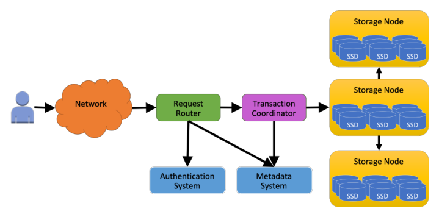

Figure 1: DynamoDB Transactions high-level architecture 

metadata subsystem. 

Similar to non-transactional requests, each transaction operation initially is received by a request router. The request routers performs the needed authentication and authorization of the request and forwards it to a fleet of transaction coordinators. Any transaction coordinator in the fleet can take responsibility for any transaction. The transaction coordinator breaks the transaction into item-level operations and runs a distributed protocol in which the storage nodes for these items participate. Figure 1 illustrates the high-level diagram of the components involved in the execution of a transaction. 

# **3.2 Timestamp ordering** 

Timestamp ordering [4, 13] is used to define the logical execution order of transactions. Upon receiving a transaction request, the transaction coordinator assigns a timestamp to the transaction using the value of its current clock. To handle the overall transactions load, there are a large number of transaction coordinators operating in parallel, and different transaction coordinators assign timestamps to different transactions. As long as transactions appear to execute at their assigned time, serializability is achieved. 

Once a timestamp has been assigned and preconditions checked, the storage nodes participating in the transaction can perform their portions of the transaction without coordination. Each storage node independently is responsible for ensuring that requests involving its items are executed in the proper order and for rejecting conflicting transactions that cannot be ordered properly. 

Although serializability holds even if the transaction coordinators do not have synchronized clocks, more accurate clocks result in more successful transactions and a serialization order that complies with real time. The clocks in the coordinator fleet are sourced from the AWS time-sync service [1], thus keeping them closely in sync 

(within a few microseconds). However, even with perfectly synchronized clocks, transactions can arrive at storage nodes out-of-order due to message delays in the network, failures and recovery of transaction coordinators, and other system issues. Storage nodes deal with transactions that arrive in any order using stored timestamps. 

# **3.3 Write transaction protocol** 

A two-phase protocol ensures that all of the writes within a transaction are performed atomically and in the proper order. To achieve atomicity, the transaction coordinator prepares all items in the first phase. In the second phase, if all the storage nodes accept the transaction, then the transaction coordinator commits the transaction and instructs the storage nodes to perform their writes. If any of the storage node cannot accept the transaction, then the transaction coordinator will cancel the transaction. Listing 2 shows the pseudo code for the TransactWriteItem protocol. 

To implement timestamp ordering for write transactions, DynamoDB records the timestamp of the write operation with every item. All write operations including singleton writes and writes within TransactWriteItems update the item timestamp. 

Storage nodes also persist per-transaction metadata for each in-flight transaction, including the transaction’s identifier and timestamp. This metadata is attached to items that are part of the transaction and remain with the items during partition-related changes, such as split. This ensures that such changes do not interfere with transactions and can happen in parallel. This information about a transaction is updated and checked during the two-phase protocol and can be discarded once the transaction has completed. 

In the prepare phase of the protocol, the transaction coordinator sends a message to the primary storage nodes for the items being written. This prepare message in- 

708    2023 USENIX Annual Technical Conference 

USENIX Association 

<!-- pdf page 6 -->

**Figures on page 6:**

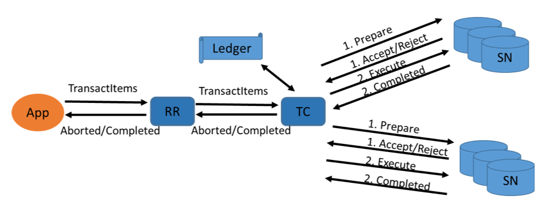

Figure 2: Two-phase protocol 

TransactWriteItem(TransactWriteItems input ): _#Prepare all items_ TransactionState = PREPARING for operation in input : sendPrepareAsyncToSN(operation) 

waitForAllPreparesToComplete() 

_#Evaluate whether to commit or cancel the transaction_ 

- if all prepares succeeded: TransactionState = COMMITTING for operation in input : sendCommitAsyncToSN(operation) 

- waitForAllCommitsToComplete() TransactionState = COMPLETED return SUCCESS 

else : 

- TransactionState = CANCELLING for operation in input : sendCancellationAsyncToSN(operation) 

- waitForAllCancellationsToComplete() TransactionState = COMPLETED return ReasonForCancellation 

Listing 2: TransactWriteItem protocol 

cludes the transaction timestamp, transaction ID, and the operation that the transaction intends to perform on the item. The storage node accepts the transaction if all of the following criteria are true for every local item that is part of the transaction: 

- All preconditions on the item are met. 

- Writing the item would not violate of any of the system restrictions such as exceeding the maximum item size. 

- The transaction’s timestamp is greater than the item’s timestamp indicating when it was last written. 

- The set of previously accepted transactions that are attempting to write the same item is empty. 

Listing 3 shows the pseudo code for prepare phase of the TransactWriteItem protocol. Note that these last two conditions are correct but over restrictive and can be relaxed as discussed in the next section. 

If the transaction is accepted by all the participating storage nodes, then the transaction coordinator will commit the transaction. If the transaction is not accepted by any of the participating storage nodes, then the transaction coordinator will cancel the transaction. After the decision has been made to commit the transaction, each participant storage node performs the desired writes on its local items and records the timestamp of the transaction as the items’ last write timestamp. Items for which a precondition was checked but that are not being written also have their timestamps updated. Listing 4 shows the pseudo code for commit/cancel phase of the TransactWriteItem protocol. 

After all participant storage nodes have executed the commit or cancellation, the transaction coordinator responds to the request router with a “completed” message and whether the transaction successfully committed. The request router forwards this response to the customer. 

Items that have been deleted require special handling since, once they are deleted, there is no longer a last write timestamp. Instead of maintaining tombstones for deleted items, which would incur both a high storage cost and garbage collection cost if items are frequently created and deleted, DynamoDB stores a partition-level max delete timestamp. When an item is deleted, if the deleting transaction’s timestamp is greater than the current max delete timestamp, then the max delete timestamp is set to the transaction’s timestamp. When a storage node receives a prepare message for a write to a non-existent item, it compares the new transaction’s timestamp against the maximum delete timestamp to decide whether to accept or re- 

USENIX Association 

2023 USENIX Annual Technical Conference    709 

<!-- pdf page 7 -->

def processPrepare(PrepareInput input ): item = readItem( input ) 

if item != NONE: 

if evaluateConditionsOnItem(item , input .conditions) AND evaluateSystemRestrictions(item , input ) AND item.timestamp < input .timestamp AND item.ongoingTransactions == NONE: item.ongoingTransaction = input .transactionId return SUCCESS else : return FAILED else : _#item does not exist_ item = new Item( input .item) if evaluateConditionsOnItem( input .conditions) AND evaluateSystemRestrictions( input ) AND partition.maxDeleteTimestamp < input .timestamp: item.ongoingTransaction = input .transactionId return SUCCESS return FAILED 

Listing 3: TransactWriteItem protocol - Prepare phase 

ject the transaction. Storing the max delete timestamp at a partition level provides a correct and efficient solution. In the current approach, transactions may be cancelled in instances where they would not have been cancelled if tombstones were maintained for deleted items. Though in practice, an insignificant percentage of transactions are cancelled due to the transaction’s timestamp being lower than the partition’s maximum delete timestamp. 

# **3.4 Read transaction protocol** 

Read transactions are also performed using a two-phase protocol, though in a different manner from write transactions and from other systems. The standard timestamp ordering scheme maintains a read timestamp on each item. Updating this timestamp for operations in a read transaction would have turned every read into a more costly write operation on persistent, replicated data. To avoid this latency and cost, DynamoDB devised a twophase writeless protocol for executing read transactions. 

In the first phase of the protocol, the transaction coordinator reads all the items that are in the transaction’s read-set. If any of these items are currently being written by another transaction, then the read transaction is rejected; otherwise, the read transaction moves to the second phase. In its response to the transaction coordinator, the storage node not only returns the item’s value but also its current committed log sequence number (LSN). The current committed LSN of the item is the sequence number of the last write that the storage node performed and acknowledged to the client. The LSN increases monotonically. 

In the second phase, the items are read again. If there 

have been no changes to the items between the two phases, namely the LSNs have not changed, then the read transaction returns successfully with all of the item values that were fetched. In the case where an item has been updated between the two rounds of the protocol, the read transaction is rejected. 

In both failure and success cases, the storage node returns the LSN. By doing so, the transaction coordinator is able to redrive another round of reads for all items without having to restart the entire transaction. In the event that the item is being prepared by a write transaction, the storage node simply rejects the read. 

# **3.5 Recovery and fault tolerance** 

Since DynamoDB automatically recovers from storage node failures, such failures are of no concern to the transaction protocol. If a storage node that is the primary for an item fails, then leadership will fail over to another storage node that is part of that item’s replication group. The metadata about transactions that had been accepted by the previous primary node is persistently stored and replicated within the group, and so is immediately available to the new primary. Transaction coordinators when continuing the transaction protocol are not even aware that they may be communicating with a different set of participating storage nodes. 

Transaction coordinator failures are of greater concern. Transaction coordinators can fail because of hardware or software issues. To ensure atomicity of transactions and that transactions complete in the face of failures, coordinators maintain a persistent record of each transaction and its outcome in a ledger. A recovery manager peri- 

710    2023 USENIX Annual Technical Conference 

USENIX Association 

<!-- pdf page 8 -->

|def processCommit(CommitInput input):|
|---|
|item = readItem(input)|
|if item == NONE OR item.ongoingTransaction != input.transactionId: return COMMIT_FAILED|
|applyChangeForCommit(item , input.writeOperation) item.ongoingTransaction = NONE item.timestamp = input.timestamp return SUCCESS|
|def processCancel(CancellationInput input): item = readItem(input)|
|if item == NONE OR item.ongoingTransaction != input.transactionId: return CANCELLATION_FAILED|
|item.ongoingTransaction = NONE|
|_#item was only created as part of this transaction_ if item was created during prepare: deleteItem(item) return SUCCESS|

Listing 4: TransactWriteItem protocol - Commit/Cancel phase 

odically scans the ledger looking for transactions that have not yet been completed (and for which a reasonable amount of time has passed since the transaction was received). Such _stalled_ transactions are assigned to a new transaction coordinator who resumes executing the transaction protocol. In the case where a transaction coordinator is incorrectly determined to have failed and its transaction reassigned, it is okay for multiple coordinators to be finishing the same transaction at the same time since duplicate attempts to write an item are ignored by its storage node. 

When the transaction has been fully processed, a _completed_ record is written to the ledger indicating that no further work is required. Information about a transaction can be purged from the ledger when it has been completed, though retaining these records turns out to be useful for monitoring and debugging. 

The transaction ledger is a DynamoDB table with transaction identifiers as the key. Multiple recovery managers regularly scan the ledger in parallel for stalled transactions that must be resumed. Each recovery manager starts its scan of the table from a random key and scans up to thousands of transactions. 

Storage nodes also invoke recovery when local items have stalled transactions. If a storage node receives a write or read for an item that is already being written by another transaction, then it checks to see if the pending transaction on the item may have stalled. If the accepted 

transaction has a timestamp that is older than some threshold, the storage node sends a message with the key for the item and the pending transaction id. The recovery manager receiving this message checks the ledger for the state of the transaction and, if the transaction has not been completed, resumes its execution. 

# **4 Adapting timestamp ordering for keyvalue operations** 

The classic timestamp ordering concurrency control scheme [4, 13] can be extended with novel optimizations when applied to a key-value store where reads and writes of individual items are mixed with multi-item transactions. Individual key get and whole item put operations can be added to an ordered execution history, while allowing for increased concurrency and the ability to execute operations out of order. We have implemented some of these techniques in DynamoDB and others we plan to integrate as we hear more feedback from our customers. This section describes our innovations on timestamp ordering along with the benefits. 

_Reads to individual items can always be performed successfully even if there is a prepared transaction that is attempting to write that item._ A get operation that is not part of a transaction is routed directly to a storage node that is responsible for the key of the item being read, bypassing transaction coordinators. The contacted storage 

USENIX Association 

2023 USENIX Annual Technical Conference    711 

<!-- pdf page 9 -->

node immediately returns the latest stored value regardless of whether a prepared transaction may later overwrite the item. Implicitly, this get operation is assigned a read timestamp that is later than the write timestamp on the stored item and before the commit timestamp of the prepared transaction. In other words, the read is serialized between the last completed write and the pending transaction. 

_Writes to individual items can be performed immediately and serialized before any prepared transactions in many cases._ Non-transactional put requests are also directly routed to the storage nodes for the item being written. The primary storage node assigns a write timestamp that is earlier than the timestamps of any transactions in the prepared state. Note that a prepared transaction has not yet performed its intended write to the item, and thus it is okay for a received put to jump ahead of such a transaction in the serialization order. The same holds for individual modify and delete operations that are received directly by storage nodes. The outcome of such operations will likely be overwritten by a prepared transaction if and when it commits. There is one case where a single-item write cannot jump ahead of a previously prepared transaction, namely when a condition on the item had been checked during the process of preparing the transaction and the newly received write operation may violate that condition. For example, suppose that a write transaction is attempting to withdraw 100 dollars from a bank account and it includes a pre-condition to ensure that the current balance contains sufficient funds. If this transaction is in the prepared state, and its condition has been verified, then the system cannot allow another withdrawal that reduces the balance below 100 dollars to jump ahead of the prepared transaction. Nor can the system permit the item to be deleted. In general, it is challenging for storage nodes to determine whether a previously checked arbitrary condition might be violated by a newly received write. However, doing so for common conditions, like numerical bounds checking, could substantially reduce rejected write operations in contentious workloads. 

_Writes to individual items can be performed immediately or delayed and serialized after any prepared transactions in other cases._ Even if a newly arriving single item write operation violates a checked condition for a prepared transaction, the storage node need not reject the write. The storage node can buffer the write operation until the transaction completes. Note that an already prepared transaction is expected to commit or cancel quickly. Waiting for the transaction is not likely to add significant delay to new write operations and the added delay is typically less than rejecting the write and requiring the client to resubmit it. Once the transaction is completed, a queued write operation can be assigned a later timestamp 

and serialized after the transaction. As a further optimization, if the storage node receives a put or delete operation that has no precondition, then this operation can be assigned a write timestamp that is later than that of any previously prepared transactions and can be performed immediately. If and when a prepared transaction with an earlier timestamp commits, its writes will be ignored. 

_Write transactions can be accepted even with an old timestamp._ If a write operation that is part of a transaction arrives at a storage node that has already performed a write (either an individual put or transactional put operation) with a later write timestamp, this transaction can still be accepted and enter the prepared state. If this transaction is committed, its write operation is ignored with the observation that, even if performed earlier, it would have been completely overwritten by the later put operation. This argument does not hold if the last write was a modify operation that partially updated the item’s contents. The benefit of accepting a transaction with an old timestamp, although it has no effect on some items being written, is that the transaction may contain write operations on other items that are allowed to complete. 

_Multiple transactions that write the same item may be prepared at the same time._ A storage node that has already prepared a transaction can accept a second transaction that is attempting to write the same item. That is, for any given item, a series of transactions that are writing the item may enter the prepared state before any of those transactions commit and perform their writes. If the transactions contain put operations that fully overwrite the item’s contents (or delete operations), then the transactions can actually commit in any order as long as the put (or delete) of the transaction with the latest timestamp is the last one to be performed. Transactions with modify operations that perform partial updates must execute in their assigned timestamp order since the final value of the item depends on the sequence of execution. 

_Read transactions can be executed in a single round rather than using a two-phase protocol._ A transaction that reads multiple items could complete in a single phase as follows. Suppose that storage nodes supported a variant of the GetItem operation, called _GetItemWithTimestamp_ , that takes a read timestamp as a parameter in addition to a primary key. This _GetItemWithTimestamp_ operation returns the latest value of the item if its last write timestamp is earlier than the given read timestamp and if any prepared transactions have later timestamps, and otherwise rejects the request. When presented with a new read transaction, the transaction coordinator assigns a timestamp for the transaction and calls _GetItemWithTimestamp_ in parallel for each item that is being read. The coordinator buffers the item values that are fetched. If none of the storage nodes reject the get call for having an old timestamp, then the coordinator returns the set of 

712    2023 USENIX Annual Technical Conference 

USENIX Association 

<!-- pdf page 10 -->

**Figures on page 10:**

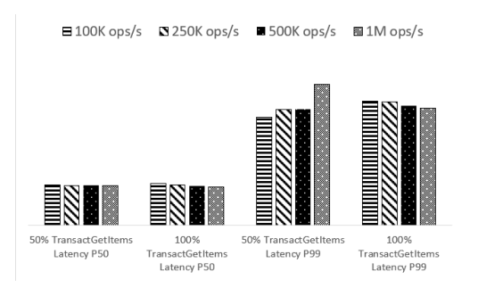

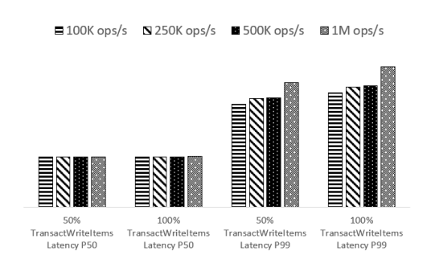

buffered values as the response to the read transaction call; otherwise, it returns an exception. This approach is optimistic in that a concurrent write to any one of the items being read could cause the transaction to be rejected. While conceptually simple, there is a subtle potential problem with this approach, namely the storage node could later accept a write with a timestamp that is earlier than that of the previously executed read transaction. That could cause a subsequent read-only transaction to not be serializable with respect to a previously executed transaction. This is a well-known issue with timestamp ordering and is avoided by having storage nodes maintain a timestamp recording when each item was last read in addition to the last write timestamp. Storage nodes would then require future write transactions to have timestamps that are later than both the previous read and write timestamps on all items being written. 

_Transactions that write multiple items in a single partition can be executed in a single round rather than using a two-phase protocol._ If all of the items that are being written in a transaction happen to reside in the same partition, and hence are stored on the same storage nodes, then the transaction does not require separate prepare and commit rounds. Since there is only one primary storage node participating in the transaction, it can perform all of the pre-condition checks that are required to accept the transaction and then immediately perform the write operations. The contacted storage node informs the transaction coordinator whether the transaction completed successfully. 

Figure 3: Comparison of TransactGetItems latencies for varying throughput 

Figure 4: Comparison of TransactWriteItems latencies for varying throughput 

# **5 Experiments** 

This section presents our findings about the performance of transaction requests along various dimensions, such as request rate, transaction size, and contentious workloads. 

# **5.1 Comparison of latencies for varying throughput of transactions** 

We conducted an experiment that scaled up the transaction request rate while maintaining the same number of operations per transaction to demonstrate that scale has a minimal effect on the latency of transactions in DynamoDB. There were three workloads in this experiment: one with fifty percent writes and fifty percent reads, one with one hundred percent reads, and one with one hundred percent writes. A uniform key distribution and an item size of 900 bytes were used in these tests. Workloads were scaled from 100 thousand to 1 million operations per second. Note that 1 million operations per second are not same as 1 million transactions per second, as each transaction consists of 3-operations. Figure 3 and Figure 4 shows the 50th and 99th percentile performance of 

TransactGetItems and TransactWriteItems operations for each workload. With the increase in throughput, both TransactGetItems and TransactWriteItems exhibit negligible variances at P50. The latency increases slightly at P99 as the request rate increases; this is due to increased java garbage collection on the transaction coordinators when the load is heavier. 

# **5.2 Comparison of latencies for varying number of operations per transaction** 

We conducted an experiment to evaluate the impact of transaction size on performance by varying the number of read and write operations per transaction while maintaining a constant total number of operations. The same uniform key distribution and items of 900 bytes were used as the previous test. Workloads ranged from accessing 3 to 100 items per transaction at a constant rate of 1 million items per second. 

Figure 5 and Figure 6 show the performance of the read and write transactions for the various workloads at 

USENIX Association 

2023 USENIX Annual Technical Conference    713 

<!-- pdf page 11 -->

**Figures on page 11:**

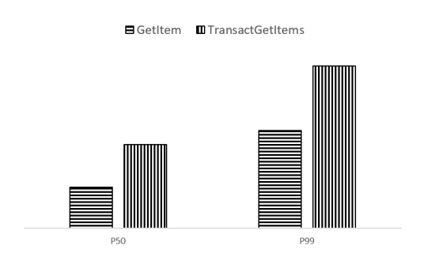

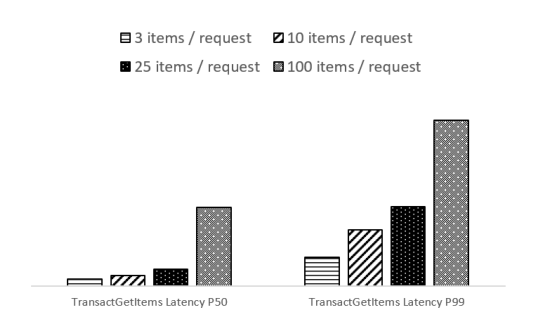

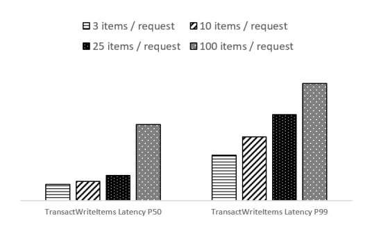

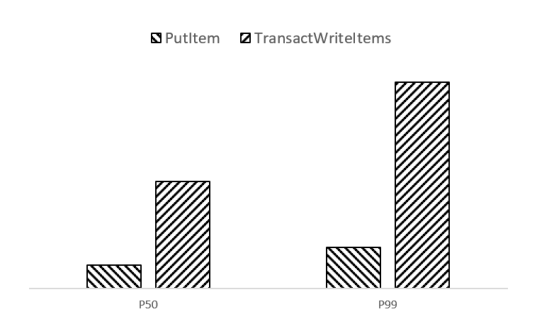

Figure 5: Comparison of latencies for varying number of operations per TransactGetItems request 

Figure 6: Comparison of latencies for varying number of operations per TransactWriteItems request 

the 50th and 99th percentiles. As the number of operations in each transaction increases, so does the latency. Although reads and writes to items within a transaction are processed in parallel, the latency of the transaction request is determined by its slowest operation. Transactions that involve a greater number of operations are more likely to experience a slow read or write. Additionally, the latency of TransactWriteItems is determined by the time it takes to persist the request to the ledger. Larger requests take longer to write to the ledger. Also, large transactions result in a larger message payload for the request, which takes longer to travel over the network between the request router and transaction coordinator. 

# **5.3 Comparison of latencies for transactions vs non-transactions** 

To examine the performance of transactions vs non-transactional requests to DynamoDB, we conducted an experiment comparing the performance of single operation transactional reads and writes 

Figure 7: Comparison of latencies for GetItem vs single operation TransactGetItems request 

Figure 8: Comparison of latencies for PutItem vs single operation TransactWriteItems request 

against non-transactional singleton reads and writes. For this experiment, we ran tests that submitted 100 thousand requests per second for each of the following DynamoDB APIs; TransactWriteItems (transactional write), TransactGetItems (transactional read), PutItem (singleton non-transactional write), and strongly consistent GetItem (singleton non-transactional read). Each request accessed a 900 byte item using the same uniform key distribution that was used in the previous experiment. 

Figure 7 shows the performance of single operation transactional vs non-transactional reads at the 50th and 99th percentile. Latency for read transactions is slightly less than 2x the latency for non-transactional reads, on account of the two consistent reads that are required as part of the TransactGetItems protocol. 

Figure 8 shows the performance of single operation transactional vs non-transactional writes at the 50th and 99th percentiles. Latency for write transactions is about 4x the latency of non-transactional writes. This is as a result of the two-phase write protocol being executed 

714    2023 USENIX Annual Technical Conference 

USENIX Association 

<!-- pdf page 12 -->

**Figures on page 12:**

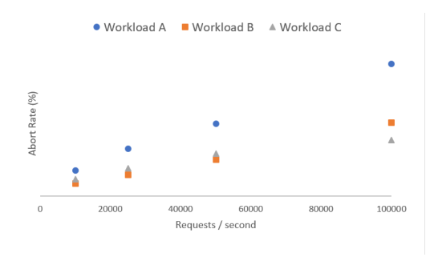

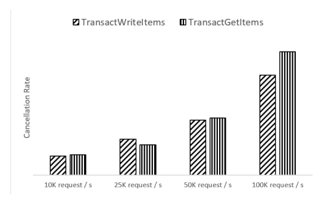

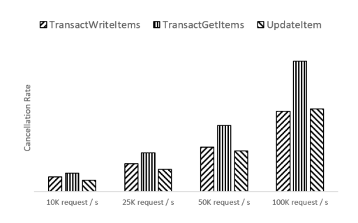

Figure 9: Cancellation rates for workloads with _contention index = 0.001_ 

on each TransactWriteItems request, with additional overhead being added for writing and checkpointing the transaction state to the Transaction Ledger. 

# **5.4 Comparison of cancellation rate for varied contentious workloads** 

To examine the performance of transactions on contentious workloads, we ran an experiment with a fixed pool of _hot_ items while scaling up throughput. Contention arises when multiple transactions are concurrently trying to access the same items(which are referred to as _hot_ items). In this context, a _contention index_ [16] refers to the fraction of _hot_ items that are accessed by a given transaction. For these experiments, throughput was scaled from 10 thousand to 100 thousand transactions per second with a fixed contention index of 0.001, which indicates that each transaction accesses one of one thousand _hot_ items [16]. The experiments ran with three different workloads: workload A consists of write transactions only, workload B consists of 50% write transactions + 50% read transactions, and workload C consists of transactions + non-transactions operations (25% write transactions, 25% read transactions, 25% non-transaction writes, 25% non-transaction consistent reads). Each transaction accesses 10 items with one of the items being from the _hot_ item pool and the remaining 9 items being from a much larger set of keys. For non-transaction reads and writes, each item is chosen from the _hot_ item pool. For each test, we measured the cancellation rate, which is the percentage of requests that were rejected because of a conflict with another transaction on a given item. 

Figure 9 reports the cancellation rates for the workloads with _contention index = 0.001_ . For all workloads, the cancellation rate increases with the transaction request rate. As each item can only be acted upon by a single transaction at a time, the level of contention and the cancellation rate rise when more transactions include 

Figure 10: Cancellation rates for workload B with _contention index = 0.001_ . Note: each request type represents an equal portion of total traffic 

Figure 11: Cancellation rates for workload C with _contention index = 0.001_ . Note: each request type represents an equal portion of total traffic 

operations on the pool of _hot_ items. Workload A, write transactions only, had the highest rate of cancellations for all transaction requests rates. Comparatively, workload B, with 50% write transactions and 50% read transactions, had about half the cancellation rate as workload A at all levels of throughput. The cancellation rates are lower for workload B as read transactions cannot be the source of conflict. 

A TransactGetItems operation will be cancelled (rejected) if any item being read has a write transaction in progress or if the item has changed between the two phases, but will not trigger a cancellation of any other operation. Moreover, figure 10 highlights that read and write transactions were cancelled at similar rates for workload B at all throughput levels with both types of transactions only getting cancelled if there was an ongoing write transaction on the targeted item. 

Workload C had the lowest cancellation rates at all throughput levels, as a result of having fewer sources of conflict than the other workloads. Figure 11 provides a 

USENIX Association 

2023 USENIX Annual Technical Conference    715 

<!-- pdf page 13 -->

breakdown of cancellation rates by operation type for workload C. GetItem (non-transaction reads) had no cancellations at all throughput levels as they are serializable with transactions and do not get rejected; if a GetItem request is received while a write transaction is in progress on a given item, the GetItem will read the current item value without conflict. Both UpdateItem (nontransaction writes) and TransactWriteItems (write transactions) have comparable cancellation rates as these requests will only be cancelled because of a conflict if there is an ongoing TransactWriteItems operation on the targeted items. Finally, TransactGetItems (read transactions) had the highest cancellation rate of any operation during this test since read transactions execute optimistically and conflict with any concurrent write. 

# **6 Related work** 

A growing number of NoSQL databases have added support for transactions in recent years. Each of these systems choose different tradeoffs, resulting in a variety of isolation levels, expressiveness, and relationships with non-transactional writes [3, 5, 12, 14–17]. 

Many of the systems use a two-phase commit protocol that is similar to DynamoDB’s protocol. G-store [7] and L-store [11] are two examples of systems that propose an alternative to two-phase commit protocols. They avoid the two-phase commit protocol by co-locating all the keys of the transaction on the node that processes the transaction and executing the transaction on that single node. 

Some systems use locks [2,16] for concurrency control, while others use timestamps. Different systems use various sources of time, including precise clocks [5], local nodes’ clocks, and hybrid logical clocks [10]. Granola [6] is an example of system that uses both locks and timestamps for concurrency control; a transaction is executed either in locking mode or timestamp mode. 

# **7 Conclusion** 

Adding transactions to DynamoDB without impacting the scale, availability, durability and predictability that customers have come to expect was a daunting task. Instead of the limited form of transactions provided in previous systems, customers asked for full ACID transactions updating multiple items from different partitions of the same table or across different tables. Working backwards from customer scenarios informed us that long running transactions were not required and that the workloads were not highly contentious. We designed transactions as single-shot operations with optimistic concurrency control using timestamp ordering to ensure that transactions 

are both serializable and scalable. This work shows that transactions implemented in a replicated and partitioned NoSQL database can be achieved with high scalability, high availability, and predictable performance. 

# **8 Acknowledgements** 

DynamoDB transactions have been greatly influenced by the invaluable feedback of our customers, driving us to innovate on their behalf. We are fortunate to be accompanied by an exceptional team throughout this journey. We express our appreciation to Shawn Bice, Andrew Certain, Raju Gulabani, Amit Gupta, Rishabh Jain, Vaibhav Jain, Nate Riley, Tony Petrossian, Amit Purohit, Julien Ridoux, Rashmi Krishnaiah Setty, Stefano Stefani, Benjamin Wood, Ming-Chuan Wu, and the entire DynamoDB team for their contributions that have been instrumental to the success of this project. We are grateful to the anonymous reviewers and our shepherd, Leonid Ryzhyk, for their invaluable contributions in refining this paper. Special thanks to Chris Andreson, Darcy Jayne, and Murat Demirbas for going the extra mile to provide valuable assistance. 

# **References** 

- [1] Keeping time with amazon time sync service. https://aws.amazon.com/blogs/aws/keepingtime-with-amazon-time-sync-service/. 

- [2] M. K. Aguilera, A. Merchant, M. Shah, A. Veitch, and C. Karamanolis. Sinfonia: A new paradigm for building scalable distributed systems. In _Proceedings of Twenty-first ACM SIGOPS Symposium on Operating Systems Principles_ , SOSP ’07, pages 159–174, New York, NY, USA, 2007. ACM. 

- [3] J. Baker, C. Bond, J. C. Corbett, J. Furman, A. Khorlin, J. Larson, J.-M. Leon, Y. Li, A. Lloyd, and V. Yushprakh. Megastore: Providing scalable, highly available storage for interactive services. 2011. 

- [4] P. A. Bernstein and N. Goodman. Timestamp-based algorithms for concurrency control in distributed database systems. In _Proceedings of the Sixth International Conference on Very Large Data Bases - Volume 6_ , VLDB ’80, pages 285–300. VLDB Endowment, 1980. 

- [5] J. C. Corbett, J. Dean, M. Epstein, A. Fikes, C. Frost, J. J. Furman, S. Ghemawat, A. Gubarev, C. Heiser, P. Hochschild, W. Hsieh, S. Kanthak, E. Kogan, H. Li, A. Lloyd, S. Melnik, D. Mwaura, D. Nagle, 

716    2023 USENIX Annual Technical Conference 

USENIX Association 

<!-- pdf page 14 -->

S. Quinlan, R. Rao, L. Rolig, Y. Saito, M. Szymaniak, C. Taylor, R. Wang, and D. Woodford. Spanner: Google’s globally-distributed database. In _Proceedings of the 10th USENIX Conference on Operating Systems Design and Implementation_ , OSDI’12, page 251–264, USA, 2012. USENIX Association. 

- [6] J. Cowling and B. Liskov. Granola: _{_ LowOverhead _}_ distributed transaction coordination. In _2012 USENIX Annual Technical Conference (USENIX ATC 12)_ , pages 223–235, 2012. 

- [7] S. Das, D. Agrawal, and A. El Abbadi. G-store: a scalable data store for transactional multi key access in the cloud. In _Proceedings of the 1st ACM symposium on Cloud computing_ , pages 163–174, 2010. 

- [8] G. DeCandia, D. Hastorun, M. Jampani, G. Kakulapati, A. Lakshman, A. Pilchin, S. Sivasubramanian, P. Vosshall, and W. Vogels. Dynamo: Amazon’s highly available key-value store. _SIGOPS Oper. Syst. Rev._ , 41(6):205–220, oct 2007. 

- [9] M. Elhemali, N. Gallagher, N. Gordon, J. Idziorek, R. Krog, C. Lazier, E. Mo, A. Mritunjai, S. Perianayagam, T. Rath, S. Sivasubramanian, J. C. S. III, S. Sosothikul, D. Terry, and A. Vig. Amazon DynamoDB: A scalable, predictably performant, and fully managed NoSQL database service. In _2022 USENIX Annual Technical Conference (USENIX ATC 22)_ , pages 1037–1048, Carlsbad, CA, July 2022. USENIX Association. 

   - [14] K. Ren, D. Li, and D. J. Abadi. Slog: Serializable, low-latency, geo-replicated transactions. _Proceedings of the VLDB Endowment_ , 12(11), 2019. 

   - [15] R. Taft, I. Sharif, A. Matei, N. VanBenschoten, J. Lewis, T. Grieger, K. Niemi, A. Woods, A. Birzin, R. Poss, et al. Cockroachdb: The resilient geodistributed sql database. In _Proceedings of the 2020 ACM SIGMOD International Conference on Management of Data_ , pages 1493–1509, 2020. 

   - [16] A. Thomson, T. Diamond, S.-C. Weng, K. Ren, P. Shao, and D. J. Abadi. Calvin: Fast distributed transactions for partitioned database systems. In _Proceedings of the 2012 ACM SIGMOD International Conference on Management of Data_ , SIGMOD ’12, pages 1–12, New York, NY, USA, 2012. ACM. 

   - [17] M. Tyulenev, A. Schwerin, A. Kamsky, R. Tan, A. Cabral, and J. Mulrow. Implementation of cluster-wide logical clock and causal consistency in mongodb. In _Proceedings of the 2019 International Conference on Management of Data_ , pages 636–650, 2019. 

- [10] S. S. Kulkarni, M. Demirbas, D. Madappa, B. Avva, and M. Leone. Logical physical clocks. In _International Conference on Principles of Distributed Systems_ , pages 17–32. Springer, 2014. 

- [11] Q. Lin, P. Chang, G. Chen, B. C. Ooi, K.-L. Tan, and Z. Wang. Towards a non-2pc transaction management in distributed database systems. In _Proceedings of the 2016 International Conference on Management of Data_ , pages 1659–1674, 2016. 

- [12] D. Peng and F. Dabek. Large-scale incremental processing using distributed transactions and notifications. In _9th USENIX Symposium on Operating Systems Design and Implementation (OSDI 10)_ , 2010. 

- [13] D. P. Reed. Implementing atomic actions on decentralized data (extended abstract). In _Proceedings of the Seventh ACM Symposium on Operating Systems Principles_ , SOSP ’79, pages 163–, New York, NY, USA, 1979. ACM. 

USENIX Association 

2023 USENIX Annual Technical Conference    717 

